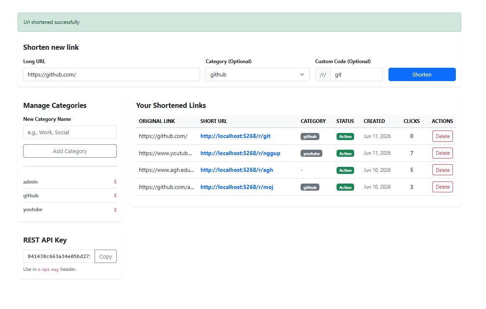
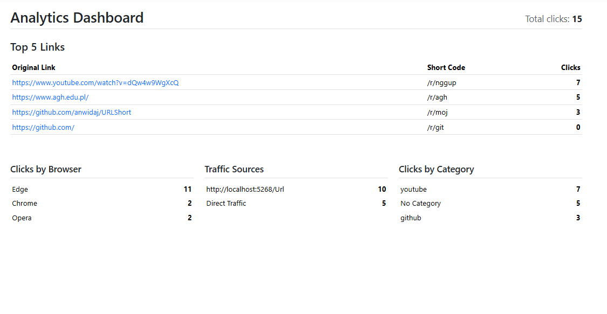

# URLShort - URL Shortener

A full-stack URL shortening platform built with **ASP.NET Core 10**. 
This project provides a web interface, a REST API, and an interactive Console Client.

## Screenshots





## Features

- **Authentication & Roles**: Built entirely on top of `HttpContext.Session`. Includes an exclusive Admin Panel for managing user accounts. Public registration is restricted by default.
- **URL Management**: Create short URLs with custom short-codes, group them into Categories, and edit their target destinations.
- **Analytics Dashboard**: Tracks every redirect. Displays click counts, breakdown by User-Agent (browser/device), and Top 5 performing links.
- **Secured REST API**: A complete set of endpoints for managing URLs and Categories programmatically. Secured via custom `X-Api-Key` and `X-Username` HTTP headers.
- **Console API Client**: An interactive CLI tool that connects to the REST API.

## Architecture

The solution follows separation of concerns and is divided into three projects:
1. **`UrlShort.Core`**: Contains the domain models (Users, ShortUrls, Categories, Clicks), Entity Framework Core `AppDb` context, and core business logic.
2. **`UrlShort.Web`**: The ASP.NET Core MVC application containing the web views, UI controllers, and REST controllers.
3. **`UrlShort.Client`**: A C# Console Application that acts as an interactive client for the REST API.

## Running the Application

### Prerequisites
- The **.NET 10 SDK** must be installed on your machine.

### 1. Start the Web Server
Navigate to the `UrlShort.Web` directory and run the server:
```bash
cd URLShort/src/UrlShort.Web
dotnet run
```
The web application will be available at `http://localhost:5268`.
*Note: If no users exist in the database, the system will automatically seed an `admin` account with the password `admin`.*

### 2. Start the API Client
In a separate terminal, navigate to the `UrlShort.Client` directory:
```bash
cd URLShort/src/UrlShort.Client
dotnet run
```
You will be prompted with an interactive menu. Make sure to update the `ApiKey` and `Username` in `Program.cs` to match the API key and username found in your web Dashboard.

## API Endpoints

All API requests must include `X-Username` and `X-Api-Key` headers.

| Method | Endpoint | Description |
|--------|----------|-------------|
| GET | `/api/url` | Retrieve all URLs belonging to the user |
| POST | `/api/url` | Create a new short URL |
| PUT | `/api/url/{id}` | Update an existing URL's destination |
| DELETE | `/api/url/{id}` | Delete a short URL |
| GET | `/api/url/categories` | Retrieve user categories |
| POST | `/api/url/categories` | Create a new category |
| DELETE | `/api/url/categories/{id}` | Delete a category |

## Tech Stack
- **Framework:** .NET 10 ASP.NET Core MVC
- **Database:** SQLite, Entity Framework Core
- **Frontend:** HTML, CSS, Bootstrap, Chart.js
- **Auth:** Custom Session-based Auth, API Keys

## Author
Developed by [Jan Wida](https://github.com/anwidaj)
